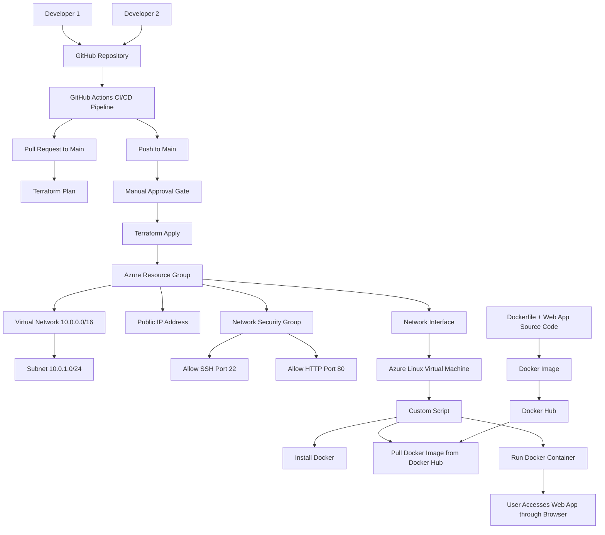

# Infrastructure as Code with Terraform and Azure

## Project 2: Containerized Web Application Deployment

### Cloud Computing & DevOps Engineering

---

## 1. Author Names and Student IDs

| Name                | Student ID   |
| --------------     | ------------ |
| Rawan Eltheni      |    4753      |
| Kalthoum Alatrash  |    4853      |

---

## 2. Project Title and Description

### Project Title

Infrastructure as Code with Terraform and Azure

### Project Description

This project demonstrates how to deploy a containerized web application to Microsoft Azure using Docker, Terraform, and GitHub Actions.

The web application is built as a Docker image, pushed to Docker Hub, and deployed on an Azure Linux Virtual Machine. Terraform is used to provision the Azure infrastructure, including the resource group, virtual network, subnet, public IP address, network security group, network interface, and virtual machine.

A custom script is used to install Docker on the virtual machine, pull the Docker image from Docker Hub, and run the container automatically. GitHub Actions is used to automate the CI/CD process with a manual approval gate before production deployment.

---

## 3. Architecture Diagram



---

## 4. Docker Image Build and Push Instructions

### 4.1 Build the Docker Image

Run the following command in the root folder of the project:

```bash
docker build -t dockerhub-username/cloudscale-webapp:latest .
```

Replace `dockerhub-username` with your Docker Hub username.

---

### 4.2 Run the Docker Container Locally

```bash
docker run -d -p 80:80 dockerhub-username/cloudscale-webapp:latest
```

Open the application in the browser:

```text
http://localhost
```

---

### 4.3 Log in to Docker Hub

```bash
docker login
```

---

### 4.4 Push the Docker Image to Docker Hub

```bash
docker push dockerhub-username/cloudscale-webapp:latest
```

---

### 4.5 Docker Hub Repository

```text
https://hub.docker.com/r/dockerhub-username/cloudscale-webapp
```

---

## 5. Terraform Setup Instructions

### 5.1 Terraform Files

The project includes the following Terraform files:

| File           | Description                                  |
| -------------- | -------------------------------------------- |
| `providers.tf` | Configures the Azure provider and backend    |
| `main.tf`      | Defines Azure resources and VM custom script |
| `variables.tf` | Defines input variables                      |
| `outputs.tf`   | Displays deployment outputs                  |

---

### 5.2 Azure Resources Created by Terraform

Terraform provisions the following Azure resources:

| Azure Resource         | Configuration                          |
| ---------------------- | -------------------------------------- |
| Resource Group         | Name includes student name             |
| Virtual Network        | Address space `10.0.0.0/16`            |
| Subnet                 | Address prefix `10.0.1.0/24`           |
| Public IP              | Static allocation                      |
| Network Security Group | Allows SSH `22` and HTTP `80`          |
| Network Interface      | Attached to VM and Public IP           |
| Linux Virtual Machine  | Ubuntu 22.04, size `Standard_B1s`      |
| Tags                   | Project, Environment, and student name |

---

### 5.3 Log in to Azure

```bash
az login
```

---

### 5.4 Initialize Terraform

```bash
terraform init
```

---

### 5.5 Format Terraform Code

```bash
terraform fmt
```

---

### 5.6 Validate Terraform Configuration

```bash
terraform validate
```

---

### 5.7 Run Terraform Plan

```bash
terraform plan
```

---

### 5.8 Apply Terraform Configuration

```bash
terraform apply
```

Type `yes` when Terraform asks for confirmation.

---

### 5.9 Access the Web Application

After Terraform finishes, copy the public IP address from the Terraform output and open it in the browser:

```text
http://<VM-PUBLIC-IP>
```

---

## 6. GitHub Actions Workflow Explanation

The GitHub Actions workflow is located in:

```text
.github/workflows/terraform.yml
```

The workflow automates the Terraform deployment process.

### Workflow Requirements

| Event                  | Action                                    |
| ---------------------- | ----------------------------------------- |
| Pull Request to `main` | Runs `terraform plan`                     |
| Push to `main`         | Runs `terraform apply`                    |
| Production Deployment  | Requires manual approval                  |
| Authentication         | Uses GitHub Secrets for Azure credentials |

---

### Required GitHub Secrets

The following secrets must be added to the GitHub repository:

| Secret Name             | Description                           |
| ----------------------- | ------------------------------------- |
| `AZURE_CLIENT_ID`       | Azure service principal client ID     |
| `AZURE_CLIENT_SECRET`   | Azure service principal client secret |
| `AZURE_SUBSCRIPTION_ID` | Azure subscription ID                 |
| `AZURE_TENANT_ID`       | Azure tenant ID                       |

---

### Manual Approval Gate

The manual approval gate is configured using GitHub Environments.

Steps:

1. Open the GitHub repository.
2. Go to **Settings**.
3. Click **Environments**.
4. Create an environment named `production`.
5. Enable **Required reviewers**.
6. Add the reviewer.
7. Save the protection rules.

When a push is made to the `main` branch, the workflow pauses before running `terraform apply`. The deployment continues only after approval.

---

## 8. Step-by-Step Detailed Solution

### Step 1: Create the Web Application

Create an `index.html` file with a custom message that includes the team members’ names.

Example:

```html
<!DOCTYPE html>
<html>
<head>
    <title>CloudScale Web App</title>
</head>
<body>
    <h1>Hello from Student 1 and Student 2</h1>
    <p>This application is running inside a Docker container on Azure.</p>
</body>
</html>
```

---

### Step 2: Create the Dockerfile

Create a `Dockerfile` to containerize the web application.

Example:

```dockerfile
FROM nginx:alpine

COPY index.html /usr/share/nginx/html/index.html

EXPOSE 80

CMD ["nginx", "-g", "daemon off;"]
```

---

### Step 3: Build the Docker Image

```bash
docker build -t dockerhub-username/cloudscale-webapp:latest .
```

---

### Step 4: Test the Docker Container Locally

```bash
docker run -d -p 80:80 dockerhub-username/cloudscale-webapp:latest
```

Open:

```text
http://localhost
```

---

### Step 5: Push the Docker Image to Docker Hub

```bash
docker login
docker push dockerhub-username/cloudscale-webapp:latest
```

---

### Step 6: Create Terraform Configuration Files

Create the following Terraform files:

```text
providers.tf
main.tf
variables.tf
outputs.tf
```

These files define the Azure provider, variables, outputs, and all required Azure infrastructure resources.

---

### Step 7: Provision Azure Infrastructure

Run the following commands:

```bash
terraform init
terraform fmt
terraform validate
terraform plan
terraform apply
```

Terraform creates the Azure resource group, virtual network, subnet, public IP, network security group, network interface, and Linux virtual machine.

---

### Step 8: Configure the VM to Run Docker

The VM custom script performs the following tasks:

1. Installs Docker.
2. Starts the Docker service.
3. Pulls the Docker image from Docker Hub.
4. Runs the container using port mapping.
5. Enables automatic restart if the VM reboots.

Example command:

```bash
docker run -d --restart always -p 80:80 dockerhub-username/cloudscale-webapp:latest
```

---

### Step 9: Configure GitHub Actions

Create the workflow file:

```text
.github/workflows/terraform.yml
```

The workflow runs `terraform plan` on pull requests and `terraform apply` on pushes to the `main` branch after manual approval.

---

### Step 10: Add GitHub Secrets

Add the Azure authentication secrets in the GitHub repository settings:

```text
AZURE_CLIENT_ID
AZURE_CLIENT_SECRET
AZURE_SUBSCRIPTION_ID
AZURE_TENANT_ID
```

---

### Step 11: Create a Pull Request

Create a pull request to the `main` branch.

The GitHub Actions workflow automatically runs:

```bash
terraform plan
```

---

### Step 12: Merge and Deploy

After reviewing the pull request, merge it into the `main` branch.

The workflow will wait for manual approval before running:

```bash
terraform apply
```

---

### Step 13: Verify the Deployment

After deployment, copy the VM public IP address from Terraform outputs and open:

```text
http://<VM-PUBLIC-IP>
```

The browser should display the containerized web application.

---

## 9. Repository Link

```text
https://github.com/username/repository-name
```

---

## Final Result

The final result is a Dockerized web application deployed on an Azure Linux Virtual Machine. The infrastructure is created with Terraform, the Docker image is stored in Docker Hub, and the CI/CD workflow is automated using GitHub Actions with a manual approval gate for production deployment.
